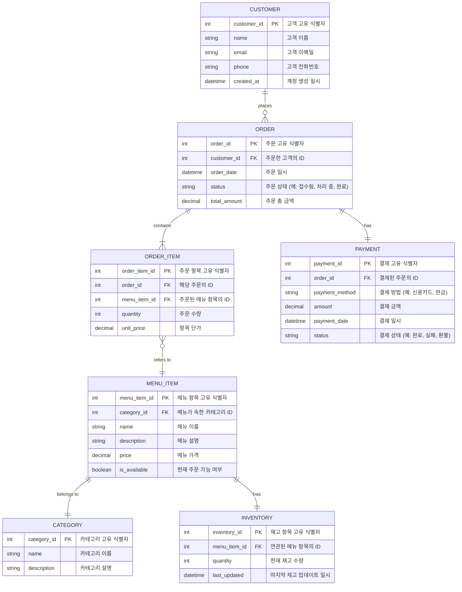

```mermaid
%% 고객과 주문 사이의 관계를 나타냄. 한 고객은 여러 주문을 할 수 있음.
erDiagram
    CUSTOMER ||--o{ ORDER : places
    %% 주문과 주문 항목 사이의 관계를 나타냄. 하나의 주문은 여러 주문 항목을 포함함.
    ORDER ||--|{ ORDER_ITEM : contains
    %% 주문 항목과 메뉴 항목 사이의 관계를 나타냄. 하나의 주문 항목은 하나의 메뉴 항목을 참조함.
    ORDER_ITEM }o--|| MENU_ITEM : "refers to"
    %% 메뉴 항목과 카테고리 사이의 관계를 나타냄. 하나의 메뉴 항목은 하나의 카테고리에 속함.
    MENU_ITEM ||--|| CATEGORY : "belongs to"
    %% 주문과 결제 사이의 관계를 나타냄. 하나의 주문은 하나의 결제를 가짐.
    ORDER ||--|| PAYMENT : has
    %% 메뉴 항목과 재고 사이의 관계를 나타냄. 하나의 메뉴 항목은 하나의 재고 항목과 연결됨.
    MENU_ITEM ||--|| INVENTORY : "has"

%% places (주문):
   %% CUSTOMER와 ORDER 사이의 관계
   %% "고객의 주문" 의미
   %% 예: 한 고객의 다수 주문 가능성

%% contains (포함):
   %% ORDER와 ORDER_ITEM 사이의 관계
   %% "주문의 주문 항목 포함" 의미
   %% 예: 하나의 주문 내 다수 주문 항목 존재

%% refers to (참조):
   %% ORDER_ITEM과 MENU_ITEM 사이의 관계
   %% "주문 항목의 메뉴 항목 참조" 의미
   %% 예: 각 주문 항목의 특정 메뉴 항목 지칭

%% belongs to (소속):
   %% MENU_ITEM과 CATEGORY 사이의 관계
   %% "메뉴 항목의 카테고리 소속" 의미
   %% 예: 각 메뉴 항목의 특정 카테고리(음료, 디저트 등) 소속

%% has (보유):
   %% ORDER와 PAYMENT 사이, MENU_ITEM과 INVENTORY 사이의 관계
   %% "직접적 연관 관계" 의미
   %% 예: 
     %%- 주문의 결제 정보 보유
     %%- 메뉴 항목의 재고 정보 보유

    CUSTOMER {
        int customer_id PK "고객 고유 식별자"
        string name "고객 이름"
        string email "고객 이메일"
        string phone "고객 전화번호"
        datetime created_at "계정 생성 일시"
    }

    ORDER {
        int order_id PK "주문 고유 식별자"
        int customer_id FK "주문한 고객의 ID"
        datetime order_date "주문 일시"
        string status "주문 상태 (예: 접수됨, 처리 중, 완료)"
        decimal total_amount "주문 총 금액"
    }

    ORDER_ITEM {
        int order_item_id PK "주문 항목 고유 식별자"
        int order_id FK "해당 주문의 ID"
        int menu_item_id FK "주문된 메뉴 항목의 ID"
        int quantity "주문 수량"
        decimal unit_price "항목 단가"
    }

    MENU_ITEM {
        int menu_item_id PK "메뉴 항목 고유 식별자"
        int category_id FK "메뉴가 속한 카테고리 ID"
        string name "메뉴 이름"
        string description "메뉴 설명"
        decimal price "메뉴 가격"
        boolean is_available "현재 주문 가능 여부"
    }

    CATEGORY {
        int category_id PK "카테고리 고유 식별자"
        string name "카테고리 이름"
        string description "카테고리 설명"
    }

    PAYMENT {
        int payment_id PK "결제 고유 식별자"
        int order_id FK "결제된 주문의 ID"
        string payment_method "결제 방법 (예: 신용카드, 현금)"
        decimal amount "결제 금액"
        datetime payment_date "결제 일시"
        string status "결제 상태 (예: 완료, 실패, 환불)"
    }

    INVENTORY {
        int inventory_id PK "재고 항목 고유 식별자"
        int menu_item_id FK "연관된 메뉴 항목의 ID"
        int quantity "현재 재고 수량"
        datetime last_updated "마지막 재고 업데이트 일시"
    }
```
